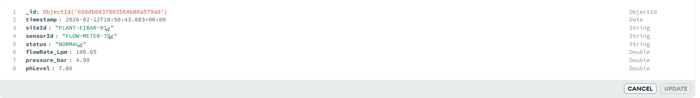
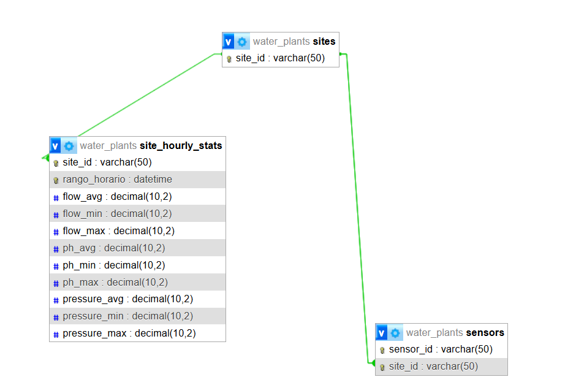

# Create 2 databases:
First, we created two databases. On the one hand, non-relational MongoDB and on the other hand relational, in this case, we have used MariaDB.

## Non-relational database data(MongoDB):
### Identification and Time
_id: Single document identifier in the database. This succession of letters and numbers distinguishes this record from all the others.

timestamp: Shows the exact time of measurement: February 12, 2026, at 10:50 a.m.

### Location and Device:
siteId ("PLANT-EIBAR-01" or "PLANT-EIBAR-02"): Installation where data has been collected. In this case, it looks like Eibar's 01 factory.

SensorId ("FLOW-METER-78" or "FLOW-METER-77"): The exact device that made the measurement; it is a flow meter (number 78).

Status: Indicates that the sensor or system is in good condition at the time, without any problems.

### Technical Measurements:
FlowRate_Lpm: Shows how many liters per minute are passing

Pressure_bar:  Shows how much pressure there is in the system.

Ph_Level: Shows the acidity/alkalinity of the liquid.





## Relational database data(MariaDB):
The water_plants database is a relational system exported as a JSON structure, designed to manage industrial water monitoring infrastructure and telemetry. It is organized into three primary tables that maintain data integrity through specific relational rules and hierarchical constraints.

The foundation of the database is the sites table, which acts as a master registry for physical locations, uniquely identifying facilities like PLANT-EIBAR-01. Linked to this is the sensors table, which assigns specific hardware models to those sites, ensuring that every active sensor is tied to a valid plant location. Finally, the site_hourly_stats table serves as the primary data log, storing aggregated measurements for flow rate, pH levels, and pressure. This table follows a strict internal logic where the recorded minimum, average, and maximum values for each hour must maintain a consistent mathematical relationship to ensure statistical accuracy.




# Data abstraction from a non-relational database to a relational database:

## Query for MongoDB:
db.data.aggregate([
  {
    //1. The first step is the $match stage, which acts as a filter. Instead of scanning your entire database, it looks specifically at the timestamp field to find records that fall within the previous hour. It uses JavaScript dates to automatically calculate the start and end of that hour (for example, from 10:00:00 to 10:59:59). This ensures that the rest of the operation only processes relevant, recent data, which makes the query much faster and more efficient.
    
    $match: {
      timestamp: {
        $gte: new Date(new Date().setHours(new Date().getHours() - 1, 0, 0, 0)),
        $lte: new Date(new Date().setHours(new Date().getHours() - 1, 59, 59, 999))
      }
    }},
    
  //2. The second step is the $group stage, where the actual "number crunching" happens. MongoDB organizes the filtered documents into "buckets" based on a unique combination of the siteId and the hour of the reading. While grouped, the database calculates several statistics at once: it finds the average, minimum, and maximum values for the water flow, the pH levels, and the pressure. By using the $dateTrunc operator, it ensures that all individual readings taken at different minutes are lumped together into a single hourly summary for each site.
    
    {$group: {
      _id: {
        siteId: "$siteId",
        rango_horario: { $dateTrunc: { date: "$timestamp", unit: "hour" } }
      },
      flow_avg: { $avg: "$flowRate_Lpm" },
      flow_min: { $min: "$flowRate_Lpm" },
      flow_max: { $max: "$flowRate_Lpm" },
      ph_avg: { $avg: "$phLevel" },
      ph_min: { $min: "$phLevel" },
      ph_max: { $max: "$phLevel" },
      pressure_avg: { $avg: "$pressure_bar" },
      pressure_min: { $min: "$pressure_bar" },
      pressure_max: { $max: "$pressure_bar" }
    }},
  
  
  //3. The final step is the $project stage, which is all about presentation and cleanup. After the grouping stage, the data structure can be a bit clunky, so this part renames fields to make them easier to read—like pulling the site ID out of the grouping object and making it a top-level field. Crucially, it also applies the $round operator to the average values. This prevents you from getting long, messy decimals (like 7.123456...) and instead rounds them to two decimal places, making the final output ready for a clean user interface or a report.  
    
    {$project: {
      _id: 0,
      site_id: "$_id.siteId",
      rango_horario: "$_id.rango_horario",
      flow_avg: { $round: ["$flow_avg", 2] },
      flow_min: 1,
      flow_max: 1,
      ph_avg: { $round: ["$ph_avg", 2] },
      ph_min: 1,
      ph_max: 1,
      pressure_avg: { $round: ["$pressure_avg", 2] },
      pressure_min: 1,
      pressure_max: 1
    }}])

  This query will be run every hour, because sensors often send data every few seconds, which can result in thousands of documents per hour. If you try to build a graph using a year’s worth of raw data, your application will likely crash or become extremely slow. By running this query every hour, you can save the summarized results into a separate collection.


## 5 more query-s:
 **1. Presio altuko alertak (\> 5,5 bar) gune zehatzetan**

    db.data.aggregate(\[  
    {   
    $match: {   
      pressure\_bar: { $gt: 5.5 }   
    }   
    },  
    {   
    $group: {   
      \_id: {   
        site: "$siteId",   
        sensor: "$sensorId"   
      },   
      alertas: { $sum: 1 }   
    }   
    }  
    \])


**2. pH balio arriskutsuak bakarrik bilatu**

    db.data.aggregate(\[  
    {  
    $match: {  
      $or: \[  
        { phLevel: { $lt: 7.0 } },  
        { phLevel: { $gt: 7.5 } }  
      \]  
    }  
    },  
    {  
    $project: {  
      \_id: 0,  
      timestamp: 1,  
      siteId: 1,  
      phLevel: 1,  
      alerta: { $literal: "CHECK\_CHEMICALS" }  
    }  
    }  
    \])  


**3. Erregistratutako 5 fluxu handienak** 

    db.data.aggregate(\[  
    { $sort: { flowRate\_Lpm: \-1 } },  
    { $limit: 5 },  
    {  
    $project: {  
      \_id: 0,  
      siteId: 1,  
      sensorId: 1,  
      Max\_flowRate: "$flowRate\_Lpm",  
       
    }  
    }  
    \])  


**4.PhLevel eta Pressure Bar txikiena duten 5 erregistro**

    db.data.aggregate(\[  
    {   
    $sort: {   
      phLevel: 1,   
      pressure\_bar: 1   
    }   
    },  
    { $limit: 5 },  
    {  
    $project: {  
      \_id: 0,  
      siteId: 1,  
      sensorId: 1,  
      Min\_phLevel: "$phLevel",  
      Min\_pressurebar: "$pressure\_bar"  
    }  
    }  
    \])  


** 5.Sensor bakoitzean egon diren alerta kopurua**

    db.data.aggregate(\[  
    { $match: { status: "LEAK\_DETECTED" } },  
    {  
    $group: {  
      \_id: "$sensorId",  
      total\_fugas: { $sum: 1 }  
    }  
    }  
    \])  
### Script to Connect MongoDB with MySQL and send information to MySQL:
```JavaScript
const { MongoClient } = require('mongodb');
const mysql = require('mysql2/promise');

    async function main() {
    const mongoUri = "mongodb://localhost:27017";
    const mongoClient = new MongoClient(mongoUri);

    const mysqlConfig = {
        host: 'localhost',
        user: 'root',
        password: 'Admin123',
        database: 'water_plants'
    };

    try {
        await mongoClient.connect();
        const connection = await mysql.createConnection(mysqlConfig);
        console.log(" Conexión establecida.");

        // --- LÓGICA PARA FILTRAR LA ÚLTIMA HORA COMPLETA ---
        const ahora = new Date();
        console.log(ahora);
        
        // Inicio: Hora anterior, minuto 00:00 (ej: 11:00:00)
        const fechaInicio = new Date(ahora);
        fechaInicio.setHours(ahora.getHours() - 1, 0, 0, 0);

        // Fin: Hora anterior, minuto 59:59 (ej: 11:59:59)
        const fechaFinal = new Date(ahora);
        fechaFinal.setHours(ahora.getHours() - 1, 59, 59, 999);

        console.log(`Buscando datos entre: ${fechaInicio.toLocaleString()} y ${fechaFinal.toLocaleString()}`);
        // --------------------------------------------------


        const database = mongoClient.db('water_plant');
        const collection = database.collection('data');

        const pipeline = [
            
             {
                $match: {
                    rango_horario: {
                        $gte: fechaInicio,
                        $lte: fechaFinal
                    }
                }
            },
            {

                
                $group: {
                    _id: {
                        siteId: "$siteId",
                        fechaHora: { $dateToString: { format: "%Y-%m-%d %H:00:00", date: "$timestamp" } }
                    },
                    avgFlow: { $avg: "$flowRate_Lpm" },
                    avgPh: { $avg: "$phLevel" },
                    avgPressure: { $avg: "$pressure_bar" },
                    minFlow: { $min: "$flowRate_Lpm" },
                    maxFlow: { $max: "$flowRate_Lpm" },
                    minPh: { $min: "$phLevel" },
                    maxPh: { $max: "$phLevel" },
                    minPre: { $min: "$pressure_bar" },
                    maxPre: { $max: "$pressure_bar" }
                }
            },
            { 
                $sort: { 
                    "_id.fechaHora": -1, 
                    "_id.siteId": 1 
                } 
            }
        ];

        const results = await collection.aggregate(pipeline).toArray();

        for (const doc of results) {
            const { siteId, fechaHora } = doc._id;

            await connection.query(
                'INSERT IGNORE INTO sites (site_id) VALUES (?)', 
                [siteId]
            );

            const sqlStats = `
                INSERT INTO site_hourly_stats 
                (rango_horario, site_id, flow_avg, flow_min, flow_max, ph_avg, ph_min, ph_max, pressure_avg, pressure_min, pressure_max) 
                VALUES (?, ?, ?, ?, ?, ?, ?, ?, ?, ?, ?)
                ON DUPLICATE KEY UPDATE 
                    flow_avg = VALUES(flow_avg),
                    ph_avg = VALUES(ph_avg),
                    pressure_avg = VALUES(pressure_avg)
            `;

            await connection.query(sqlStats, [
                fechaHora,       
                siteId,          
                doc.avgFlow ? doc.avgFlow.toFixed(2) : 0, 
                doc.minFlow, 
                doc.maxFlow,
                doc.avgPh ? doc.avgPh.toFixed(2) : 0, 
                doc.minPh, 
                doc.maxPh,
                doc.avgPressure ? doc.avgPressure.toFixed(2) : 0, 
                doc.minPre, 
                doc.maxPre
            ]);
        }

        console.log(` Success: They have synchronized ${results.length} .`);
        
        await connection.end();

    } catch (error) {
        console.error(" Error during execution:", error);
    } finally {
        await mongoClient.close();
    }
    }

    main().catch(console.error);
```

1.  Data Distillation
This script acts as a bridge between two different database worlds. It takes "noisy," high-frequency sensor data from MongoDB (NoSQL) and converts it into a clean, structured format for MySQL (Relational). The main goal is to turn thousands of raw logs into a single, easy-to-read summary for every hour.

2. The Technical Process
Filtering: The script dynamically calculates the "previous hour" (e.g., 10:00:00 to 10:59:59) so it only processes a specific slice of time.

Aggregation: Using MongoDB's aggregation engine, it calculates the Average, Minimum, and Maximum for flow, pH, and pressure.

Refinement: It rounds long decimal numbers to two places and formats the timestamps into a standardized string (YYYY-MM-DD HH:00:00).

3. Safe Synchronization
Finally, the script moves the results to MySQL with two "fail-safes":

Site Management: It checks if the site exists in the master list; if not, it adds it automatically.

The Upsert: It uses a "duplicate key update" logic. If the script runs twice for the same hour, it won't create an error or a double entry; it simply updates the existing record with the most recent data.


## Query MySQL to extract information that you want to show in the web:
    SELECT * FROM site_hourly_stats WHERE site_hourly_stats.site_id = "The site you want to show" AND site_hourly_stats.rango_horario LIKE "The day you want to show%";


### Docker sortu MondoDB:

By moving your MongoDB setup from a localized Docker container to a networked Replica Set, you have transitioned from a volatile "sandbox" to a persistent, high-availability infrastructure. This configuration is used to ensure data durability and fault tolerance; if one container fails, the cluster automatically elects a new primary node to prevent downtime. Unlike a basic laboratory setup, your use of Docker Volumes ensures that data remains intact across container restarts, mimicking the stateful requirements of a professional production environment.

Furthermore, by enabling external connectivity for tools like Compass, you have established a centralized data hub capable of remote administration and cross-machine integration. This allows for real-world testing of security protocols, such as Role-Based Access Control (RBAC) and network latency, which are often ignored in isolated labs. Essentially, you have used this cluster to build a secure, scalable, and observable database service that can support external applications while providing deep insights into the system's live performance and health.


