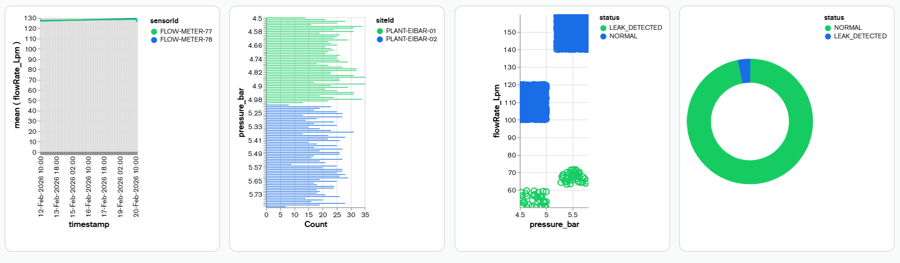

# Cluster
## Sortuta

MondgoDB Atlas ean erregistratu gara eta cluster bat sortu dugu. 

---

  Gero databasea eta kolekzioa sortu ditugu eta MongoDB-ean erabilitako json-a importatu dugu.

## Ip WhiteList
Soilik gure ip-ak sartzeko cluster-ean ipini ditugu.

---

## Adimen Artifiziala

Azkenik Adimen Artifiziala gehitu diogu query-ak egiteko.

# Grafikoa

