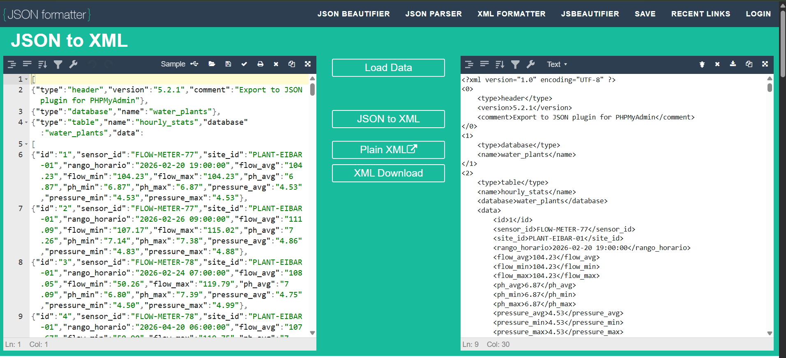
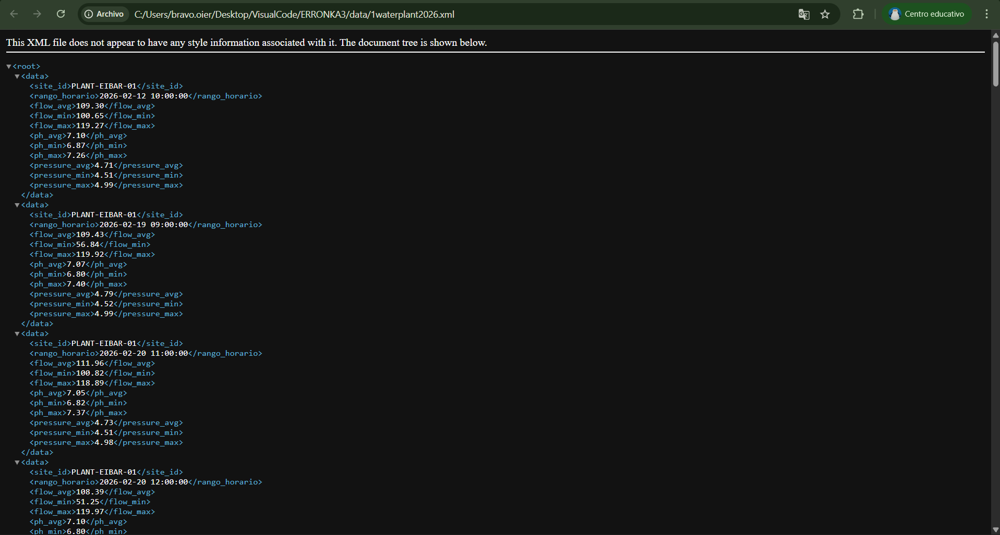

# Javascript

## JSON-XML

Hasteko MariaDB-tik atera dugun JSON-a XML-era pasa dugu orrialde baten bidez



> **Note:** https://jsonformatter.org/json-to-xml.


## XML Validator

Aldaketa batzuk egin eta gero XML-a balidatu dugu Google Chrome-ekin irekitzen.



---

## script.js

Hasteko javascript fitxategia aldatzen hasi ginen. Gure helburua zen xml batetik datuak dinamikoki jasotzea. Orduan hasierako var hauek guztiz kendu genituen eta hau gehitu genuen.

```javascript
 $.ajax({
        url: 'data/1waterplant2026.xml',
        dataType: 'xml',
        success: function (xml) {
            UrPlantaDatuak = [];

            $(xml).find('data').each(function () {
                var site     = $(this).find('site_id').text().trim();
                var sensor   = $(this).find('sensor_id').text().trim();
                var timestamp = $(this).find('rango_horario').text().trim();
                var flowAvg  = parseFloat($(this).find('flow_avg').text().trim());
                var flowMin  = parseFloat($(this).find('flow_min').text().trim());
                var flowMax  = parseFloat($(this).find('flow_max').text().trim());
                var phAvg    = parseFloat($(this).find('ph_avg').text().trim());
                var phMin    = parseFloat($(this).find('ph_min').text().trim());
                var phMax    = parseFloat($(this).find('ph_max').text().trim());
                var pressAvg = parseFloat($(this).find('pressure_avg').text().trim());
                var pressMin = parseFloat($(this).find('pressure_min').text().trim());
                var pressMax = parseFloat($(this).find('pressure_max').text().trim());

                if (!site || !timestamp || isNaN(flowAvg) || isNaN(phAvg) || isNaN(pressAvg)) return;

                UrPlantaDatuak.push({
                    timestamp: timestamp,
                    location:  site,
                    sensorId:  sensor,
                    flowAvg:   flowAvg,
                    flowMin:   isNaN(flowMin) ? flowAvg : flowMin,
                    flowMax:   isNaN(flowMax) ? flowAvg : flowMax,
                    phAvg:     phAvg,
                    phMin:     isNaN(phMin) ? phAvg : phMin,
                    phMax:     isNaN(phMax) ? phAvg : phMax,
                    pressAvg:  pressAvg,
                    pressMin:  isNaN(pressMin) ? pressAvg : pressMin,
                    pressMax:  isNaN(pressMax) ? pressAvg : pressMax
                });
            });


```

Kode hau xml-tik ajax erabiliz datuak dinamikoki jasotzen ditu. Datu horiek array batzuetan gordetzeko kode hau erabili dut. For erabili beharrean .each erabili dut, hau da, erregistro bakoitzean UrPlantaDatuak array-a timestamp, site, sensor... gordeko ditu.

---

Gero Kontrol-Panelean filtratzeko kode hau erabili dugu:

```javascript
            var egunak = [];
            for (var j = 0; j < UrPlantaDatuak.length; j++) {
                var eguna = UrPlantaDatuak[j].timestamp.split(' ')[0];
                if (egunak.indexOf(eguna) === -1) egunak.push(eguna);
            }
            egunak.sort();
            $('#eguna-select').empty();
            for (var k = 0; k < egunak.length; k++) {
                $('#eguna-select').append('<option value="' + egunak[k] + '">' + egunak[k] + '</option>');
            }

            var lekuak = [];
            for (var l = 0; l < UrPlantaDatuak.length; l++) {
                var lekua = UrPlantaDatuak[l].location;
                if (lekuak.indexOf(lekua) === -1) lekuak.push(lekua);
            }
            lekuak.sort();
            $('#lekua-select').empty();
            for (var m = 0; m < lekuak.length; m++) {
                $('#lekua-select').append('<option value="' + lekuak[m] + '">' + lekuak[m] + '</option>');
            }

            $('#bistaratu-btn').prop('disabled', false).text('Bistaratu');
        }
```

Kode hau for batekin datuak dituzten egunak array batean gordetzen ditu eta gero aukera bezala erakusten ditu. Lekuekin berdina egiten du.

---

Botoiaren funtzionamendua ziurtatzeko funtzio hau sortu dugu.

```javascript
    function datuakBistaratu() {
        var aukeratutakoLekua = $('#lekua-select').val();
        var aukeratutakoEguna = $('#eguna-select').val();
        var html = '';

        if (UrPlantaDatuak.length === 0) {
            $('#urplanta-edukiontzia').html('<p>Ez dago daturik kargatuta.</p>');
            return;
        }

        var iragazitakoDatuak = [];

        for (var i = 0; i < UrPlantaDatuak.length; i++) {
            var neurketa = UrPlantaDatuak[i];

            if (
                neurketa.timestamp.startsWith(aukeratutakoEguna) &&
                neurketa.location === aukeratutakoLekua
            ) {
                iragazitakoDatuak.push(neurketa);

                var ordua = neurketa.timestamp.split(' ')[1].substring(0, 5);

                var egoeraKlasea, egoeraTestua;
                if (neurketa.flowMin < neurketa.flowAvg * 0.6) {
                    egoeraKlasea = 'egoera-beroa';
                    egoeraTestua = 'Ihesa';
                } else if (neurketa.phAvg < 6.5 || neurketa.phAvg > 8.5) {
                    egoeraKlasea = 'egoera-ertaina';
                    egoeraTestua = 'pH Anomalia';
                } else {
                    egoeraKlasea = 'egoera-ona';
                    egoeraTestua = 'Normala';
                }

                html +=
                    '<div class="urplanta-txartela ' + egoeraKlasea + '">' +
                    '<div class="txartel-goiburua">' +
                    '<span class="ordua">' + ordua + '</span>' +
                    '<span class="egoera-etiketa">' + egoeraTestua + '</span>' +
                    '</div>' +
                    '<div class="txartel-gorputza">' +
                    '<div class="datua">' +
                    '<span class="balioa">' + neurketa.flowAvg.toFixed(2) + '</span>' +
                    '<span class="unitatea">Emaria avg (L/min)</span>' +
                    '</div>' +
                    '<div class="datua-minmax">' +
                    '<span class="minmax">↓ ' + neurketa.flowMin.toFixed(2) + '</span>' +
                    '<span class="minmax">↑ ' + neurketa.flowMax.toFixed(2) + '</span>' +
                    '</div>' +
                    '<div class="datua">' +
                    '<span class="balioa">' + neurketa.pressAvg.toFixed(2) + '</span>' +
                    '<span class="unitatea">Presioa avg (bar)</span>' +
                    '</div>' +
                    '<div class="datua-minmax">' +
                    '<span class="minmax">↓ ' + neurketa.pressMin.toFixed(2) + '</span>' +
                    '<span class="minmax">↑ ' + neurketa.pressMax.toFixed(2) + '</span>' +
                    '</div>' +
                    '<div class="datua">' +
                    '<span class="balioa">' + neurketa.phAvg.toFixed(2) + '</span>' +
                    '<span class="unitatea">pH avg</span>' +
                    '</div>' +
                    '<div class="datua-minmax">' +
                    '<span class="minmax">↓ ' + neurketa.phMin.toFixed(2) + '</span>' +
                    '<span class="minmax">↑ ' + neurketa.phMax.toFixed(2) + '</span>' +
                    '</div>' +
                    '</div>' +
                    '</div>';
            }
        }

        if (iragazitakoDatuak.length === 0) {
            html = '<p>Ez dago daturik aukeratutako leku eta egunarekin.</p>';
        }

        $('#urplanta-edukiontzia').html(html);

        if (iragazitakoDatuak.length > 0) {
            var avgFlow = iragazitakoDatuak.reduce(function (s, d) { return s + d.flowAvg; }, 0) / iragazitakoDatuak.length;
            var avgPres = iragazitakoDatuak.reduce(function (s, d) { return s + d.pressAvg; }, 0) / iragazitakoDatuak.length;
            var avgPh = iragazitakoDatuak.reduce(function (s, d) { return s + d.phAvg; }, 0) / iragazitakoDatuak.length;
            $('#avgTemp').text(avgFlow.toFixed(2));
            $('#avgHum').text(avgPres.toFixed(2));
            $('#avgPh').text(avgPh.toFixed(2));
            $('#total').text(iragazitakoDatuak.length);
        } else {
            $('#avgTemp').text('—');
            $('#avgHum').text('—');
            $('#avgPh').text('—');
            $('#total').text(0);
        }

        grafikoaEguneratu(iragazitakoDatuak);
    }

```

Funtzio hau bilatzeko botoiari emandakoan zein egun eta zein planta aukeratu den jasotzen du. Eguna eta planta berdina duten datuak array batean sartzen ditu. Daturik ez badago errore hori azalduko da. Jarraian datuak div-etan sailkatzen ditu. Azkenik 2 if jarri ditugu grafikoa behar dituen datuak jasotzeko, eta horiekin batezbestekoa minimoa eta maximoa kalkulatuzeko erabiliko dira.

---

Azkenik Grafikoa egiteko kode hau erabili dugu.

```javascript

    function grafikoaEguneratu(datuak) {
        var ctx = document.getElementById('urplanta-grafikoa').getContext('2d');

        if (UrPlantaGrafikoa !== null) {
            UrPlantaGrafikoa.destroy();
        }

        var etiketak = datuak.map(function (d) { return d.timestamp.split(' ')[1].substring(0, 5); });
        var flowDatuak = datuak.map(function (d) { return d.flowAvg; });
        var presDatuak = datuak.map(function (d) { return d.pressAvg * 10; });
        var phDatuak = datuak.map(function (d) { return d.phAvg * 10; });

        UrPlantaGrafikoa = new Chart(ctx, {
            type: 'line',
            data: {
                labels: etiketak,
                datasets: [
                    {
                        label: 'Emaria avg (L/min)',
                        data: flowDatuak,
                        borderColor: 'rgba(231, 76, 60, 1)',
                        backgroundColor: 'rgba(231, 76, 60, 0.1)',
                        tension: 0.3
                    },
                    {
                        label: 'Presioa avg (bar) *10',
                        data: presDatuak,
                        borderColor: 'rgba(52, 152, 219, 1)',
                        backgroundColor: 'rgba(52, 152, 219, 0.1)',
                        tension: 0.3
                    },
                    {
                        label: 'pH avg *10',
                        data: phDatuak,
                        borderColor: 'rgba(46, 204, 113, 1)',
                        backgroundColor: 'rgba(46, 204, 113, 0.1)',
                        tension: 0.3
                    }
                ]
            },
            options: {
                maintainAspectRatio: false,
                plugins: {
                    legend: { position: 'top' }
                },
                scales: {
                    y: { beginAtZero: false }
                }
            }
        });
    }

```
